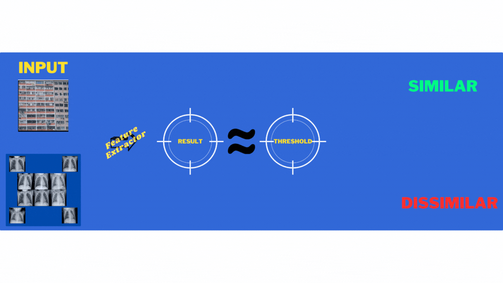

# Image Classification Out-of-Classes

Hello there! Welcome to my "Image Classification Out-of-Classes" project. This repository focuses on the task of classifying lung images, specifically Chest X-Ray Images (Pneumonia) from Kaggle. You can find the dataset [here](https://www.kaggle.com/datasets/paultimothymooney/chest-xray-pneumonia).

## Project Overview

In this project, I aim to solve the image classification problem for lung images. I have designed and evaluated a classifier using the powerful Vision Transformer (Vit). Additionally, I have explored two solutions for images that fall outside the designated classes.

## Getting Started

### 1. Solve imblance dataset

As I delve into this project, I encounter an imbalanced dataset. To address this issue, I have created a new dataset with an added class, which can be accessed [here](https://www.kaggle.com/datasets/ahmedhaytham/chest-xray-images-pneumonia-with-new-class). This new dataset introduces the classification problem of distinguishing between normal, bacterial, and viral lung images, expanding beyond the binary classification of normal and pneumonia cases. Before training the model, I augment the data

### 2. Classifier
For the classification task, I used the powerful Vision Transformer  (Vit) model. To ensure optimal performance, I implemented two different approaches using transfer learning techniques, as outlined in the book "Deep Learning for Vision Systems."

#### In the first model,
I created a new top layer to fine-tune the classification process. However, the results were not as promising as I had hoped. Undeterred, I decided to explore further.

#### The second model was a game-changer.
I adopted a selective approach by training only the last five layers of the Vit model. This strategic adjustment yielded significantly better results in terms of classification accuracy and performance.

sure! needs improvments

### 3.Out of classes
In this project, I explore two methods for handling images that fall outside the designated classes. The first method I employed is based on cosine similarity.

### 3.1 cosine similiraty
To apply cosine similarity, I randomly selected 10 images from the dataset. I input these images into the model, excluding the top layer, to obtain the last vector that contains the extracted features. I then compared these feature vectors with each other to calculate the mean similarity threshold.  

Next, when an input image is presented, I compare its feature vector with the previously obtained set of feature vectors. By calculating the mean similarity of the input image with the set of reference images, I can make a decision based on whether the mean similarity exceeds the threshold. This enables me to determine if the input image falls within one of the designated classes or if it is out of classes. 

This approach allows for the identification of images that may not fit into the predefined classes. By leveraging cosine similarity and threshold comparisons, I can provide a mechanism for detecting and handling images that deviate from the expected classes.

test images

res

### 3.2 Discriminator
In addition to the cosine similarity approach, I also implemented a discriminator model which is (VIT) too inspired by the concept of Generative Adversarial Networks (GANs). The discriminator acts as a binary classifier to determine whether an image is similar to the dataset or not.

Using the Intel dataset [here](https://www.kaggle.com/datasets/puneet6060/intel-image-classification). as a reference instead of random noise, I trained the discriminator to distinguish between images that resemble the dataset and those that do not. The discriminator model learns to identify key patterns and features present in the dataset images, enabling it to make informed decisions.

#### res

## Image search engine

It utilizes the ResNet-50 without taining deep learning model to extract feature vectors from images and compares them with the vectors of images in the dataset. 
I randomly choose 5 classes to test in it  

this is clustring for them

#### Test cases

The first image is considered as the query image, while the remaining images in the dataset are considered as similar images. It is important to note that the query image is included in the list of similar images, as it is inherently similar to itself.

#### Test cases with just CNN not trained

## 🎉 Conclusion 🎉

[ref](https://github.com/IbrahimSobh/imageclassification)

That brings us to the end of this "Image Classification Out-of-Classes" repository. Using PyTorch and the timm library, we have successfully developed effective image classification models.

But wait, there's more to come! In the next repository file, we will explore the fascinating world of image search engines. Get ready to dive into the exciting realm of visual search and uncover its possibilities.

 # Why did the image classifier bring a ladder? Because it wanted to reach new heights of accuracy! **sorry will be last one**

